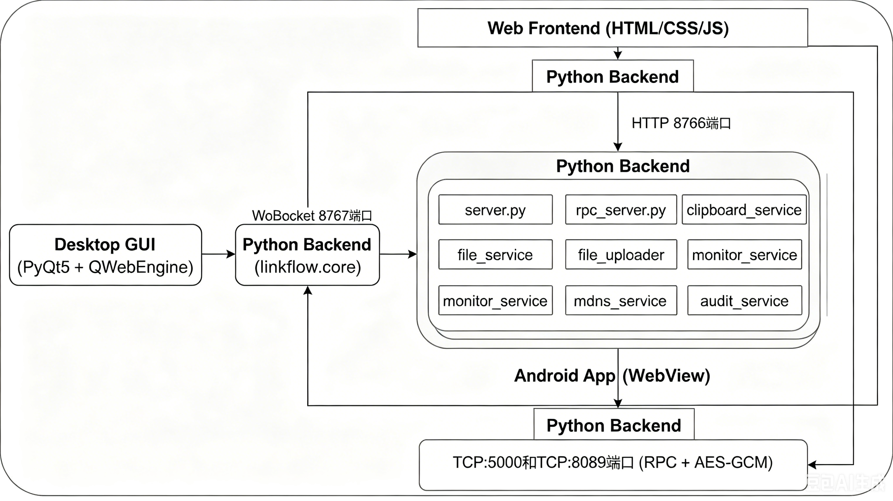
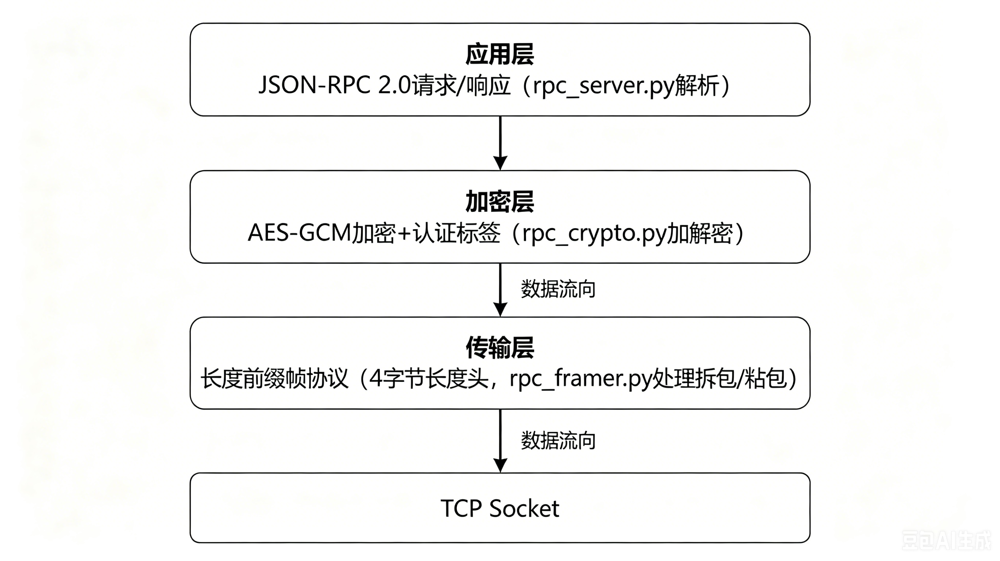
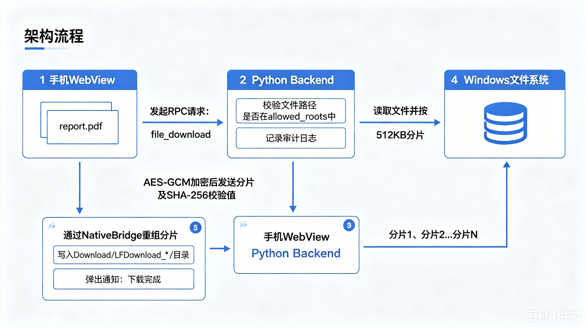

# LinkFlow

跨设备剪贴板与文件同步系统 —— 在 PC 与 Android 设备间实现无缝的剪贴板共享、文件传输和远程控制。


***

## 一句话定位

> **LinkFlow 把 Windows PC 变成你的随身工作站。** 在手机上实时查看 PC 剪贴板、浏览下载 PC 文件、远程控制 PC 状态 —— 所有操作在同一个局域网内完成，无需数据线，无需登录账号，端到端加密。

***

## 产品特色

### 场景一：你在 PC 上复制了一段文字或截图，想在手机上用

打开 LinkFlow 手机端，PC 剪贴板内容已经在那里了。点击即可复制到手机，图片自动保存到相册。**双向同步，PC 上也能拿到手机复制的内容。**

| 能力   | 描述                       |
| ---- | ------------------------ |
| 实时同步 | PC 剪贴板变化后秒级推送到手机，无需手动刷新  |
| 历史记录 | 完整保留剪贴板历史，随时回溯查找之前复制的内容  |
| 图片支持 | 截图、图片文件均可同步，手机端一键保存到系统相册 |

### 场景二：你想在手机上浏览 PC 上的文件，下载或上传

LinkFlow 把 PC 文件系统搬到了手机上。像用文件管理器一样浏览目录、搜索文件，点击下载到手机；也可以从手机上传文件到 PC 当前目录。

| 能力   | 描述                                  |
| ---- | ----------------------------------- |
| 远程浏览 | 手机上浏览 PC 任意授权目录，支持多级导航和文件搜索         |
| 双向传输 | 下载 PC 文件到手机 / 从手机上传文件到 PC，分片校验保证完整性 |
| 权限管控 | 按目录设置只读或读写权限，未授权路径不可访问              |

### 场景三：你离开电脑后想远程控制它

静音、睡眠、锁屏、重启 —— 手机上点一下就能执行。还能实时查看 PC 的 CPU、内存、电池状态。

| 能力   | 描述                             |
| ---- | ------------------------------ |
| 一键控制 | 静音 / 睡眠 / 熄屏 / 重启 / 防休眠，手机即遥控器 |
| 实时监控 | CPU 占用率、内存使用、电池电量、进程列表实时可见     |

### 场景四：你关心安全和可追溯性

所有操作自动记录审计日志。通信全程 AES-GCM 端到端加密，密钥只在你的两台设备之间交换。

| 能力    | 描述                                |
| ----- | --------------------------------- |
| 端到端加密 | JSON-RPC 2.0 协议搭载 AES-GCM，防窃听、防篡改 |
| 审计日志  | 按时间和操作类型查询，敏感操作完整留痕               |
| 零配置发现 | mDNS 协议自动发现局域网内的 PC，扫码即可连接        |

***

## 技术栈如何协同工作

LinkFlow 由 **四层技术栈** 构成，各自承担独立职责，又通过标准化接口紧密配合。下面以一次完整的 **"手机下载 PC 文件"** 操作为例，贯穿展示各层的协同关系。

### 全景架构



### 四层技术栈详解

#### 第 1 层：Web 前端 — 用户界面

| 技术                      | 角色                                  |
| ----------------------- | ----------------------------------- |
| **Vanilla HTML/CSS/JS** | 零依赖，纯内联脚本，体积不到 100KB                |
| **desktop/index.html**  | PC 桌面版控制中心，内嵌在 PyQt QWebEngine 中渲染  |
| **mobile/index.html**   | 移动端响应式界面，加载于 Android WebView 或手机浏览器 |

**为什么不用 React/Vue？** LinkFlow 的前端只做展示和交互，不需要复杂状态管理。零依赖意味着零构建步骤、极速加载、维护成本极低。桌面端和移动端共享同一套 HTTP API，各自只需一个 HTML 文件。

#### 第 2 层：Python 后端 — 业务核心

这是 LinkFlow 的大脑。每个 Python 模块对应一个独立服务：

| 模块                     | 职责                               | 关键依赖                             |
| ---------------------- | -------------------------------- | -------------------------------- |
| `server.py`            | TCP 二进制协议服务端，处理原生 Android App 连接 | —                                |
| `rpc_server.py`        | JSON-RPC 2.0 加密服务端，所有核心 API 的入口  | `rpc_crypto.py`, `rpc_framer.py` |
| `clipboard_service.py` | Windows 剪贴板读写，多格式支持              | `pywin32`                        |
| `file_service.py`      | 文件系统浏览、搜索、权限校验                   | —                                |
| `file_uploader.py`     | 分片上传管理，512KB 分片 + SHA-256 校验     | —                                |
| `monitor_service.py`   | CPU/内存/电池/进程采集，远程控制命令执行          | `psutil`                         |
| `mdns_service.py`      | mDNS 局域网服务注册与发现                  | `zeroconf`                       |
| `audit_service.py`     | 操作审计日志写入与查询，按天轮转                 | —                                |
| `utils.py`             | HTTP 静态文件服务 + WebSocket 推送桥接     | `websockets`                     |

**后端启动时做了什么：**

1. `main.py` 启动 HTTP 服务（端口 8766）托管前端页面，同时启动 WebSocket 服务（端口 8767）用于实时推送
2. 启动 RPC 加密服务端（端口 8089）等待 Android App 连接
3. 启动 mDNS 广播，让同一局域网的手机自动发现 PC
4. 启动剪贴板监听，一旦 Windows 剪贴板变化就推送给所有在线设备

#### 第 3 层：加密通信层 — 安全管道

所有 PC 与手机之间的 RPC 通信经过 **三层封装**：



**安全设计要点：**

- AES-GCM 同时提供加密和完整性校验，任何篡改都会被检测到
- 每次会话独立生成 Nonce，防止重放攻击
- 密钥通过安全的配对流程在设备间交换，不在网络上明文传输

#### 第 4 层：Android 原生壳 — 移动端容器

| 组件                  | 角色                                           |
| ------------------- | -------------------------------------------- |
| **WebView**         | 加载 `mobile/index.html`，渲染移动端 UI              |
| **NativeBridge**    | JavaScript ↔ Kotlin 桥接，前端调原生能力（文件下载、系统分享、通知） |
| **MainActivity.kt** | 管理 WebView 生命周期，处理权限申请、IP 配置                 |

Android App 本质上是一个 **增强型 WebView 容器**。UI 逻辑全部在前端 HTML 中，NativeBridge 只暴露少量原生能力：

- 文件下载到手机 Download 目录
- 调用系统文件选择器上传
- 系统通知推送

### 端到端数据流示例：手机下载 PC 文件



整个过程从用户点击到文件落盘，涉及 Web 前端 → JSON-RPC → AES-GCM → TCP → file\_service → 文件系统，每一层各司其职，层与层之间通过标准化接口通信。

***

## 技术栈一览

| 层级         | 技术                                  | 说明                       |
| ---------- | ----------------------------------- | ------------------------ |
| **桌面 GUI** | PyQt5 + PyQtWebEngine               | 内嵌 Chromium 浏览器加载前端 UI   |
| **桌面后端**   | Python 3.10+                        | 核心业务逻辑、服务编排              |
| **Web 前端** | Vanilla HTML/CSS/JS                 | 零依赖，内联脚本，极轻量             |
| **移动端**    | Kotlin + Android WebView            | 加载移动端 Web UI + 原生桥接      |
| **通信协议**   | TCP + WebSocket + JSON-RPC 2.0      | 多通道通信，WebSocket 用于前端实时推送 |
| **加密**     | AES-GCM (cryptography)              | 端到端加密，防窃听篡改              |
| **服务发现**   | mDNS (zeroconf)                     | 局域网零配置设备发现               |
| **打包**     | PyInstaller (PC) + Gradle (Android) | 单文件 exe / APK 分发         |

***

## 项目结构

```
LinkFlow/
├── python/                             # PC 端 Python 服务
│   ├── main.py                         # 应用入口，服务编排
│   ├── launcher.py                     # PyInstaller 启动器
│   ├── requirements.txt                # Python 依赖清单
│   ├── start_linkflow.bat              # 一键启动脚本
│   ├── diagnose.bat                    # 诊断脚本
│   ├── fix_and_start.bat               # 修复并启动脚本
│   ├── run_with_log.bat                # 带日志启动脚本
│   └── linkflow/
│       ├── core/                       # 核心业务模块
│       │   ├── server.py               # TCP 服务端（二进制协议）
│       │   ├── protocol.py             # 二进制有线协议编解码
│       │   ├── rpc_server.py           # JSON-RPC 2.0 加密服务端
│       │   ├── rpc_crypto.py           # AES-GCM 加密模块
│       │   ├── rpc_framer.py           # 长度前缀帧协议
│       │   ├── clipboard_service.py    # Windows 剪贴板读写
│       │   ├── file_service.py         # 文件系统浏览服务
│       │   ├── file_uploader.py        # 分片文件上传管理
│       │   ├── monitor_service.py      # 系统监控与远程控制
│       │   ├── mdns_service.py         # mDNS 局域网服务发现
│       │   ├── audit_service.py        # 操作审计日志
│       │   ├── hotspot_service.py      # Wi-Fi 热点管理
│       │   └── utils.py                # HTTP + WebSocket 桥接服务
│       └── gui/                        # PyQt5 桌面界面
│           └── main_window.py          # 主窗口 + QWebEngine 集成
│
├── web/                                # Web 前端
│   ├── desktop/index.html              # 桌面控制中心 (PC UI)
│   └── mobile/                         # 移动端 Web UI
│       ├── index.html                  # 移动端主页面
│       ├── manifest.json               # PWA 清单
│       ├── sw.js                       # Service Worker
│       └── icon-1254.png               # PWA 图标
│
├── android-app/                        # Android WebView 应用
│   ├── build.gradle                    # 项目构建配置
│   ├── settings.gradle                 # Gradle 设置
│   └── app/
│       ├── build.gradle                # 模块构建配置
│       └── src/main/
│           ├── java/.../MainActivity.kt # 主 Activity + 原生桥接
│           ├── assets/setup.html        # IP 配置页面
│           ├── res/                     # 布局/主题/图标资源
│           └── AndroidManifest.xml      # 权限与组件声明
│
├── tests/                              # 测试
│   ├── fixtures/                       # 测试数据（JSON）
│   └── unit/                           # 单元测试（13 个模块）
│
├── test-assets/                        # 测试辅助
│   ├── fixtures/                       # 测试数据
│   ├── mock/                           # Mock 模块
│   └── smoke/                          # 冒烟测试
│
├── Image/                              # 架构图
│   ├── Outline.png                     # 系统架构总览
│   ├── RPC.png                         # 加密通信层
│   └── Downloadflow.png                # 文件下载数据流
│
└── docs/                               # 项目文档
```

---

## 测试

项目采用三层测试体系，覆盖核心协议、业务逻辑、服务端 API、桌面与移动端 UI。

### 测试目录结构

```
tests/
├── unit/                              # 单元测试（14 个模块）
│   ├── test_server.py                 # TCP 服务器核心
│   ├── test_protocol.py               # （通过 server 测试间接覆盖）
│   ├── test_rpc_crypto.py             # AES-GCM 加解密
│   ├── test_rpc_framer.py             # 长度前缀帧协议
│   ├── test_rpc_server_pairing.py     # RPC 服务器配对流程
│   ├── test_clipboard.py              # 剪贴板读取
│   ├── test_clipboard_set.py          # 剪贴板写入
│   ├── test_file_chunk.py             # 文件分块传输协议
│   ├── test_file_upload.py            # 文件上传会话管理
│   ├── test_allowlist.py              # 路径白名单 ACL
│   ├── test_audit.py                  # 审计日志
│   ├── test_mdns_service.py           # mDNS 服务发现
│   ├── test_heartbeat.py              # 心跳协议
│   ├── test_main_web_message.py       # Web 消息路由处理
│   └── test_handle_web_file_chunk.py  # Web 文件分块异步处理
│
├── fixtures/                          # 单元测试数据（JSON）
│   ├── pairing_context.json           # 配对上下文样例
│   ├── file_chunk_result.json         # 文件分块响应样例
│   └── system_stats_result.json       # 系统状态响应样例
│
├── test_connection_diagnostic.py      # TCP/WebSocket 连通性诊断
├── test_network_info.py               # WebSocket 网络信息接口
├── test_network_fix.py                # 桌面端网络修复验证
├── test_desktop_ui.py                 # 桌面端 UI 冒烟测试
├── test_desktop_fixed.py              # 桌面端页面加载验证
├── test_desktop_full.py               # 桌面端完整功能测试
├── test_device_selector_mobile.py     # 移动端设备选择器
├── test_device_selector_full.py       # 移动端设备选择器（综合）
├── test_simple_ip_input.py            # 移动端 IP 输入交互
└── test_ui_optimization.py            # UI 优化回归验证

test-assets/
├── fixtures/                          # 冒烟测试数据（JSON）
├── mock/module_mocks.py               # 模块契约 Mock（配对、连接、RPC）
└── smoke/run_smoke.py                 # 一键冒烟测试
```

### 测试层级说明

| 层级 | 框架 | 覆盖范围 |
| --- | --- | --- |
| **单元测试** | `unittest.TestCase` 同步 + `unittest.IsolatedAsyncioTestCase` 异步 | TCP 服务器启动/文件列表/心跳、JSON-RPC 加解密/帧协议/配对、剪贴板读写、文件分块/上传、路径白名单 ACL、审计日志、mDNS 服务发现、Web 消息路由 |
| **浏览器测试** | Playwright | 桌面端 index.html 加载/IP 显示/WebSocket 连接、移动端设备选择器/按钮交互/IP 输入（iPhone 视口 + 触摸事件模拟） |
| **冒烟测试** | 独立脚本 | 合并前快速验证：fixture 文件有效性检查 + 禁止跨模块代码耦合扫描 |
| **网络诊断** | `asyncio` + `websockets` + `socket` | TCP 端口连通性、WebSocket 接口响应 |

### 运行测试

```bash
# 运行全部单元测试
cd tests
python -m unittest discover -s unit -p "test_*.py"

# 运行单个模块
python -m unittest unit/test_rpc_crypto.py

# 运行冒烟测试
cd test-assets/smoke
python run_smoke.py

# 运行浏览器测试（需要 Playwright + 服务端运行中）
cd tests
python test_desktop_ui.py
python test_device_selector_mobile.py

# 网络诊断（无需服务端）
python test_connection_diagnostic.py
```

### Mock 与 Fixture 设计

- **`module_mocks.py`**：定义了 `PairingContextDTO` 和 `RpcSessionDTO` 数据类，以及 `mock_discover()`、`mock_connect()`、`mock_rpc()` 三个函数。各模块可基于这些契约独立开发，无需依赖其他模块的实际实现。
- **`fixtures/*.json`**：不可变的 JSON-RPC 2.0 格式响应样例，供冒烟测试验证协议契约的正确性。在 `tests/fixtures/` 和 `test-assets/fixtures/` 中各有一份，确保单元测试和冒烟测试使用相同的数据契约。

***

## 环境依赖

### PC 端

| 依赖            | 版本要求    | 用途              |
| ------------- | ------- | --------------- |
| Python        | ≥ 3.10  | 运行环境            |
| PyQt5         | ≥ 5.15  | 桌面 GUI 框架       |
| PyQtWebEngine | ≥ 5.15  | 内嵌浏览器控件         |
| websockets    | ≥ 11.0  | WebSocket 双向通信  |
| cryptography  | ≥ 41.0  | AES-GCM 加密      |
| zeroconf      | ≥ 0.132 | mDNS 局域网发现      |
| psutil        | ≥ 5.9   | 系统资源监控          |
| pywin32       | ≥ 306   | Windows 剪贴板 API |
| qrcode        | ≥ 7.4   | 二维码生成（配网）       |
| PyInstaller | ≥ 6.0 | exe 打包（仅构建时需要） |
| Playwright | ≥ 1.40 | 浏览器 UI 自动化测试（仅测试时需要） |

### Android 端

| 依赖              | 版本要求                 | 用途         |
| --------------- | -------------------- | ---------- |
| Android SDK     | API 34 (compileSdk)  | 编译环境       |
| Min SDK         | API 24 (Android 7.0) | 最低兼容版本     |
| Kotlin          | 1.9.x                | 开发语言       |
| Gradle          | 8.7+                 | 构建工具       |
| AndroidX WebKit | 1.11.0               | WebView 增强 |

***

## 本地部署运行

### 1. 克隆项目

```bash
git clone https://github.com/your-username/LinkFlow.git
cd LinkFlow
```

### 2. PC 端启动（开发模式）

```bash
# 进入 Python 源码目录
cd python

# 创建虚拟环境（推荐）
python -m venv venv
venv\Scripts\activate    # Windows
# source venv/bin/activate  # macOS/Linux

# 安装依赖
pip install -r requirements.txt

# 启动服务（命令行模式）
python main.py

# 或启动 GUI 模式
python launcher.py
```

启动后：

- 桌面控制中心：`http://localhost:8766/desktop`
- 移动端界面：`http://localhost:8766/mobile`
- 手机连接地址：`http://<你的电脑IP>:8766/mobile`
- RPC 服务端口：`8089`（供原生 Android App 连接）

### 3. PC 端打包（生产模式）

```bash
cd python

# 确保已安装 UPX（可选，进一步压缩体积）
# 下载 https://upx.github.io/ 放入 PATH

# 打包为单文件 exe
pyinstaller --onefile main.py

# 输出文件位于 dist/main.exe
```

### 4. Android 端构建

```bash
# 进入 Android 项目目录
cd android-app

# 使用 Gradle 构建（需要 Android SDK）
gradlew assembleDebug

# APK 输出路径
# app/build/intermediates/apk/debug/app-debug.apk
```

或直接在 Android Studio 中打开 `android-app` 目录，点击 **Build → Build Bundle(s) / APK(s) → Build APK(s)**。

### 5. 连接配对

1. 在 PC 上启动 LinkFlow 服务
2. 确保手机与 PC 在同一局域网
3. 手机安装并打开 APK，输入 PC 的 IP 地址后连接
4. 连接成功后自动进入主界面，开始同步使用

***

## 使用指南

### 桌面控制中心

| 区域       | 功能                         |
| -------- | -------------------------- |
| **剪贴板**  | 实时显示剪贴板历史，支持文本和图片的查看、复制、删除 |
| **文件管理** | 浏览 PC 文件系统，授权/撤销文件夹访问权限    |
| **设备管理** | 查看已连接设备、设备状态、连接方式          |
| **系统监控** | 查看 CPU/内存/电池仪表盘，执行远程控制命令   |
| **设置**   | 配置端口、安全密钥、暗色模式、自动启动等       |

### 移动端助手

| 功能        | 操作                                     |
| --------- | -------------------------------------- |
| **剪贴板同步** | 自动拉取 PC 剪贴板，点击内容复制到手机，支持保存图片           |
| **文件浏览**  | 点击"文件管理"浏览 PC 文件，点击文件下载到手机 Download 目录 |
| **文件上传**  | 点击上传按钮选择手机文件，自动传输到 PC 当前浏览目录           |
| **PC 控制** | 点击控制面板执行静音/睡眠/重启等远程操作                  |

### 文件下载位置

- **Android 10+**：`内部存储/Download/LFDownload_YYYYMMDD/`
- **Android 7-9**：`内部存储/Download/LFDownload_YYYYMMDD/`
- 保存的图片可在系统相册的 `Pictures/LinkFlow/` 中查看

***


### 代码规范

| 类型              | 规范                                                                                                                 |
| --------------- | ------------------------------------------------------------------------------------------------------------------ |
| **Python**      | PEP 8，4空格缩进，类型注解（Type Hints）推荐                                                                                     |
| **Kotlin**      | Kotlin Coding Conventions，4空格缩进                                                                                    |
| **HTML/CSS/JS** | 2空格缩进，内联脚本，无外部 JS 依赖                                                                                               |
| **Commit**      | 遵循 [Conventional Commits](https://www.conventionalcommits.org/)：`feat:` / `fix:` / `docs:` / `refactor:` / `test:` |

### 开发环境配置

```bash
# Python 后端
cd python
pip install -r requirements.txt

# Android 应用（需要 Android Studio）
# 用 Android Studio 打开 android-app/

# Web 前端（无需构建工具，直接编辑即可）
# 文件位于 web/
```

***


### 性能优化

- 打包体积优化：使用 `--onefile` 打包并通过 `--exclude-module` 排除 numpy/pandas/matplotlib 等大型库
- WebView 内存：Android 端使用单 Activity + 单一 WebView 实例，避免内存泄漏
- 文件传输：分片大小 512KB，大文件传输时内存占用可控

### 安全注意事项

- AES-GCM 加密密钥通过安全的配对流程交换，不外传
- 文件访问受 `allowed_roots` ACL 机制保护
- 审计日志按天轮转，敏感操作完整记录
- 禁止在代码中硬编码密钥或凭证

***

## 许可证

本项目采用 [MIT License](LICENSE) 开源协议。

<br />

